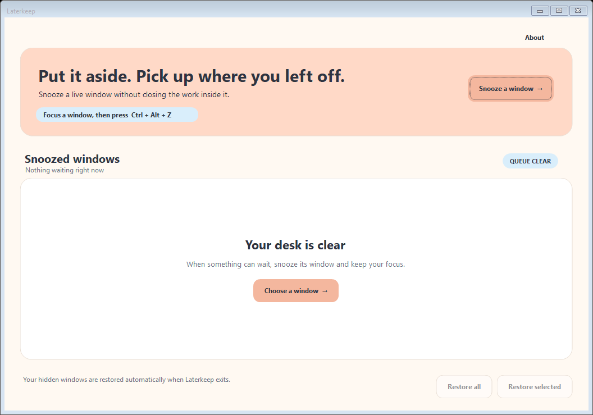
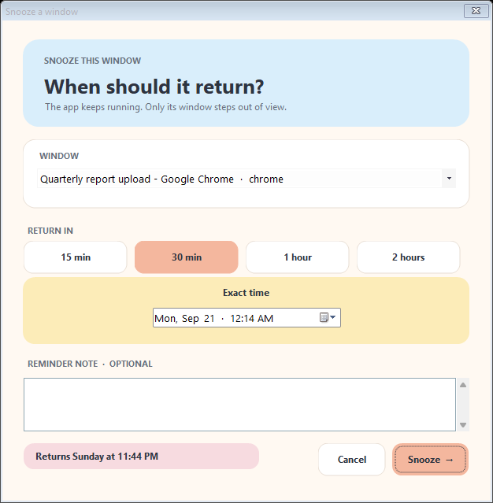

# Laterkeep

Put it aside. Pick up where you left off.

Laterkeep is a focused Windows utility for the moments when an application needs your attention later, not now. Choose when its window should return, continue with your work, and pick up exactly where you left off.

## A quieter desktop

Minimizing a window gets it out of the way, but it also makes unfinished work easy to forget. Laterkeep gives that window a return time.

1. Focus the window you want to revisit.
2. Press `Ctrl + Alt + Z`.
3. Choose a quick preset or an exact return time.
4. Add an optional reminder and snooze the window.

The application keeps running while its window is hidden. When the snooze ends, the same live window returns.

## Highlights

- Snooze normal desktop windows with a global shortcut.
- Choose 15 minutes, 30 minutes, one hour, two hours, or an exact time.
- Add a short reminder for the returning window.
- Review every snoozed window in one dashboard.
- Restore one window early or restore the full queue.
- Recover valid queue entries after an unexpected restart.
- Restore hidden windows automatically when Laterkeep exits normally.
- Run entirely locally without an account, advertising, or analytics.

## Privacy by design

Laterkeep does not read window contents, record keystrokes, capture screenshots, or upload window information. It stores only the details required to restore the current queue: window handle, process identifier, title, return time, and optional reminder note.

Read the complete [privacy policy](PRIVACY.md).

## Download

Laterkeep is a free Windows application. Download the latest official portable build from [Releases](https://github.com/KSAGlory/Laterkeep/releases).

The source code is private and proprietary. This public repository contains only reviewed product information, support documentation, presentation assets, and official compiled releases. It does not contain the application source code or internal build tooling.

## Requirements

- Windows 10 version 1809 or later, or Windows 11
- x64 desktop system
- .NET Framework 4.8 for the portable build

Some administrator-level or protected system windows may reject control from a normally launched application.

## Support and security

Use [GitHub Issues](https://github.com/KSAGlory/Laterkeep/issues) for reproducible product problems and feature requests. Read [SUPPORT.md](SUPPORT.md) before posting and follow [SECURITY.md](SECURITY.md) for private vulnerability reporting.

## Author and community

- Author: **KSAGlory**
- Community: [discord.gg/ksahub](https://discord.gg/ksahub)

Copyright © 2026 KSAGlory. All rights reserved.
